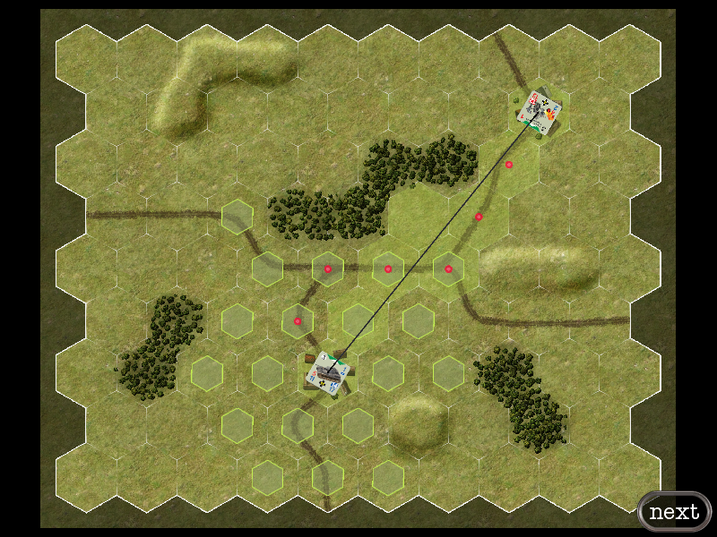
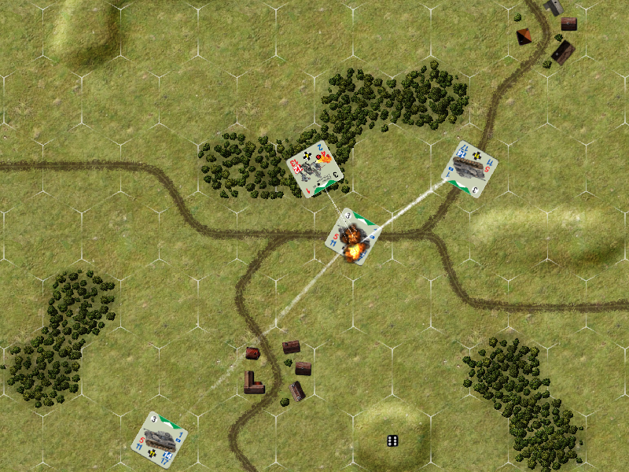
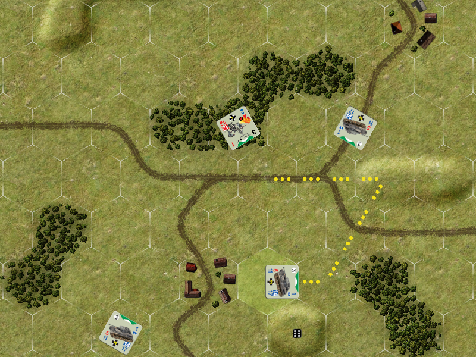
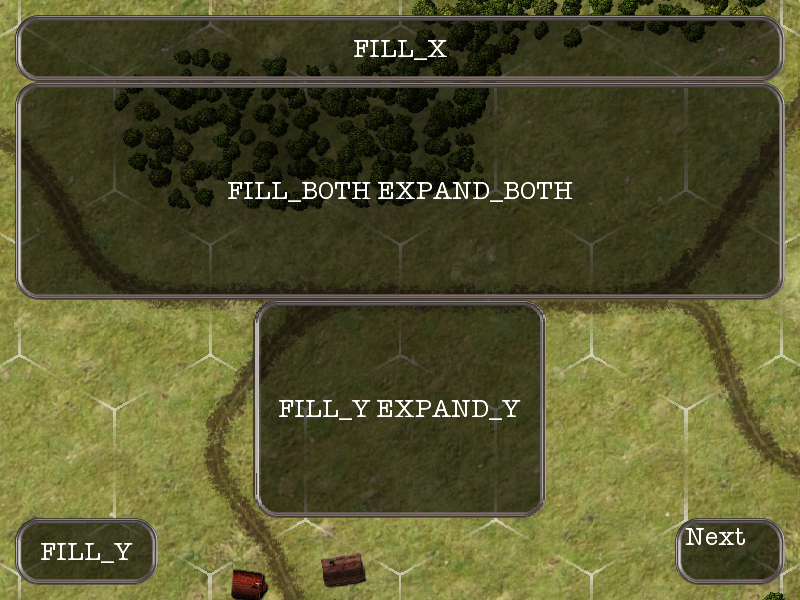

# gdx-boardgame
[](https://jitpack.io/#jeremyz/gdx-boardgame)
[](https://travis-ci.org/jeremyz/gdx-boardgame)

is a [libgdx](https://libgdx.badlogicgames.com/) based framework to build 2D boardgames.

code is mainly extracted from [rustanddust](https://github.com/jeremyz/rustanddust).
check [godot-hexgrid](https://github.com/jeremyz/godot-hexgrid) for the [godot](https://godotengine.org/)/gdscript implementation.

base map made with [gimp](https://www.gimp.org) and my plugin [hexmap](https://github.com/jeremyz/hexmap)

## features

    - moveable, zoomable board with tile identification on touch
    - moveable, orientable pieces
    - various animations
    - 3D line of sight, possible moves, shortest path

## screenshots






## install

Add the repository:
```groovy
	allprojects {
		repositories {
			maven { url 'https://jitpack.io' }
		}
	}
```
Add the dependency to all subprojects: (You can replace `master-SNAPSHOT` with a tag from github)
```groovy
	dependencies {
			implementation 'com.github.jeremyz:gdx-boardgame:master-SNAPSHOT'
	}
```
If you use the html module, you have to add also this module to its dependencies:
```groovy
	dependencies {
			implementation 'com.github.jeremyz:gdx-boardgame:master-SNAPSHOT:sources'
	}
```

For the html build, you have to add this line to your *.gwt.xml files in the html project:
```xml
<inherits name='ch.asynk.gdx.boardgame'/>
```

## javadoc

[Latest](https://javadoc.jitpack.io/com/github/jeremyz/gdx-boardgame/master-SNAPSHOT/javadoc/)
